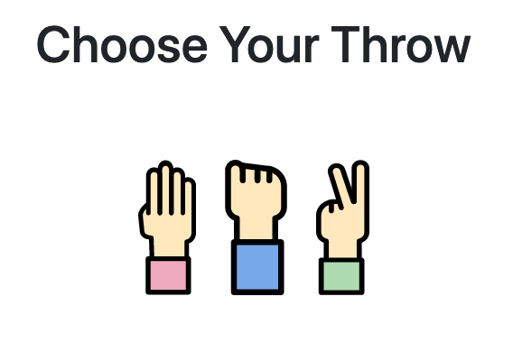

## Built With

- Ruby 2.7.2
- Ruby on Rails 6.0.4.1
- Bootstrap 5.1.3
- Postgresql 13.3
- Rspec-rails 5.1"

## To get a local copy up and running:

1. Clone this repository.

   ```
   git clone https://github.com/zilton7/rps-challenge.git
   ```

2. Navigate to the location of the folders you have cloned and
   Instal gems with:

   ```
   bundle install
   ```

3. Setup database with:

   ```
   rails db:create
   ```

4. Run application with:

   ```
   rails server
   ```

5. Access the app on your browser:

   ```
   localhost:3000
   ```

## Testing

Run tests with:

```
rspec
```

## Author

**Zil Norvilis**

[](https://github.com/zilton7)  
[](https://www.linkedin.com/in/zil-norvilis/)  
[](https://twitter.com/devnor7)
